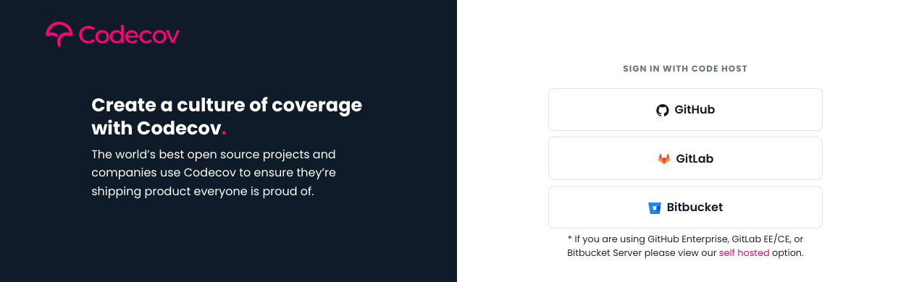
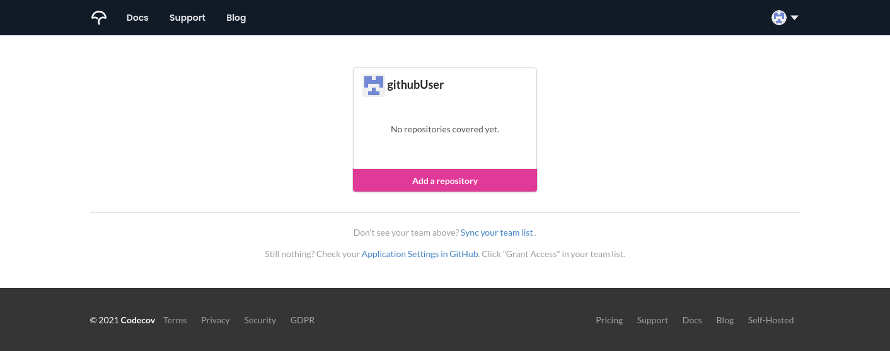
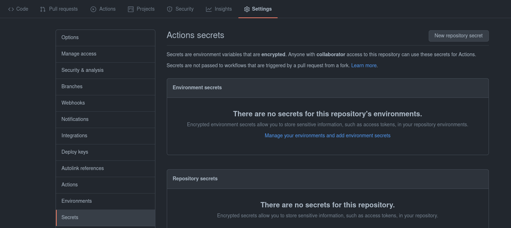
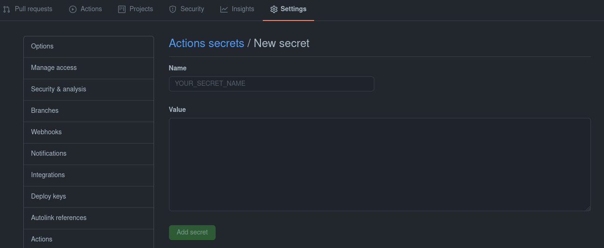
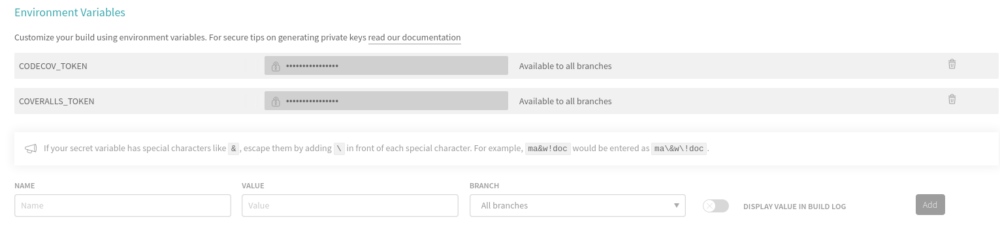
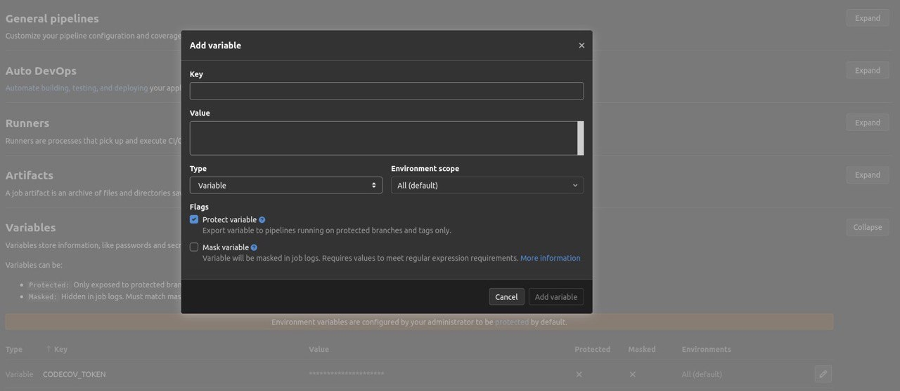
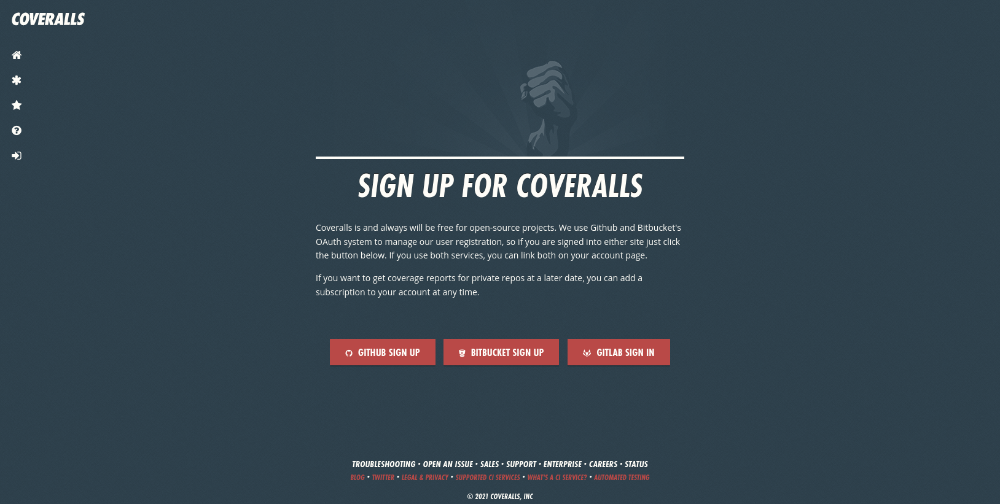

Code Coverage With Codecov and Coveralls
========================================

Platforms such as Codecov and Coveralls are automated online code coverage
services that allows you to keep track of the code coverage overtime.

Codecov
---------

Registration
~~~~~~~~~~~~~

Sign up for an account via the Codecov sign up page with either your
Github or Gitlab account. Codecov would then require some access to
be authorized, select them accordingly and proceed with authorizing
the access.

Repository selection
~~~~~~~~~~~~~~~~~~~~~

After the registration, you would be brought to a page to select the
repository for code coverage. Click on the Add a repository button and
select the repository of interest from the list. (Alternatively, you
could specify the repository directly in the link:
``https://codecov.io/gh/<username>/REPO``)

The Upload token would be shown, take note of it as we may need to use
it later on.

.. _gh_token:

Via Github Actions
~~~~~~~~~~~~~~~~~~~

To upload the report, the bash uploader provided would be used. However,
the project token has to be specified before the upload. To setup the token,
we would be using the Action secrets to store the Codecov token. Access
the page via the repository settings, followed by Secrets on the side panel.

Click on the New Repository Secret button and you would be brought to
a new page.

Enter the following into the respective textbox::

   Name: CODECOV_TOKEN
   Value: {Your Codecov Token, as shown previously}

After the token has been added, the ``CODECOV_TOKEN`` variable should
appear under the repository secrets section. Next, append the following
lines (after the ``industrial_ci`` job section) to your github action
configuration file located in ``.github/workflows`` directory:

.. code-block:: YAML

   name: CI
   on: [push, pull_request]
   jobs:
     industrial_ci:
       strategy:
         matrix:
           env:
             - {ROS_DISTRO: foxy, ROS_REPO: main}
       env:
         CODE_COVERAGE: codecov.io
       runs-on: ubuntu-latest
       steps:
         - uses: actions/checkout@v1
         - uses: 'ros-industrial/industrial_ci@master'
           env: ${{matrix.env}}
         - uses: codecov/codecov-action@v1
          #token: ${{ secrets.CODECOV_TOKEN }} # For private repo

.. note::

   The ``CODECOV_TOKEN`` is required for private repository, but optional
   for public repository.

Via Travis CI
~~~~~~~~~~~~~~

Add the following lines in the ``.travis.yml`` configuration file to
upload the report to Codecov:

.. code-block:: YAML

   env:
     global:
      - CODE_COVERAGE="codecov.io"
      #- CODECOV_TOKEN=$CODECOV_TOKEN  # For private repo

.. note::

   The ``CODECOV_TOKEN`` is required for private repository, but optional
   for public repository.

.. _travis_token:

CODECOV_TOKEN setup
^^^^^^^^^^^^^^^^^^^^

The ``CODECOV_TOKEN`` could be set by entering the settings of the repository,
under ``More options > Settings``, and fill in the fields under the
Environmental variables.

.. _gl_token:

Via Gitlab CI
~~~~~~~~~~~~~~

Setup the repository token via ``Settings > CI/CD``. Click on the "expand"
button and then the "Add Variable" button on the bottom left.

Uncheck the "Protect Variable" option and enter the following::

   Key: CODECOV_TOKEN
   Value: {Your Codecov Token}

After the token has been added, the ``CODECOV_TOKEN`` variable should
appear under the Variables section. Next, add the following lines in
the ``.gitlab-ci.yml`` configuration file in the respective sections:

.. code-block:: YAML

   before_script:
     - apk add --update bash coreutils tar curl
     - git clone --quiet --depth 1 https://github.com/ros-industrial/industrial_ci .industrial_ci -b master
   ...
   variables:
     CODE_COVERAGE: "codecov.io"
     CODECOV_TOKEN: $CODECOV_TOKEN

Coveralls
----------

Registration
~~~~~~~~~~~~~

Sign up with your preferred Git platform, allowing the various
access as required.

Repository selection
~~~~~~~~~~~~~~~~~~~~~

After the registration, you would be brought to a page to select the
repository for code coverage. Click on the ``Add Repo`` button on the
left sidebar and you would be brought to another page.

.. image:: ../assets/coverall_sel.png

Select the repository of interest by toggling the switch beside the title.
Click on details and take note of the token.

Via Github Actions
~~~~~~~~~~~~~~~~~~~

Setup the ``coveralls`` token as an Github secret variable, as
``COVERALLS_TOKEN``. (Refer to :ref:`gh_token` for more details.)

.. code-block::

   Name: COVERALLS_TOKEN
   Value: {Your Coveralls Token, as shown previously}

After that, append the following lines (after the ``industrial_ci``
job section) to your github action configuration file located in
``.github/workflows`` directory:

.. code-block:: YAML

   ...
   jobs:
     industrial_ci:
       strategy:
         matrix:
           env:
             - {ROS_DISTRO: foxy, ROS_REPO: main}
       env:
         CODE_COVERGAE: coveralls.io
         COVERALLS_REPO_TOKEN: "..."
       runs-on: ubuntu-latest
       steps:
       ...

Via Travis CI
~~~~~~~~~~~~~~

Add the following lines in the ``.travis.yml`` configuration file to
upload the report to ``coveralls``:

.. code-block:: YAML

   env:
     global:
      - CODE_COVERAGE="coveralls.io"
      #- COVERALLS_REPO_TOKEN=$COVERALLS_TOKEN # For private repo

.. note::

   Refer to :ref:`travis_token` for more details on setting up the ``COVERALLS_TOKEN``.

Via Gitlab CI
~~~~~~~~~~~~~~

Setup the ``coveralls`` token as a Gitlab variable, as
``COVERALLS_TOKEN``. (Refer to :ref:`gl_token` for more details.)

.. code-block::

   Name: COVERALLS_TOKEN
   Value: {Your Coveralls Token}

After that, add the following lines in the ``.gitlab-ci.yml`` configuration
file in the respective sections:

.. code-block:: YAML

   before_script:
     - apk add --update bash coreutils tar grep curl           # Install industrial_ci dependencies
     - apk add --update python3 py3-pip python3-dev            # Extra tools needed
     - git clone --quiet --depth 1 https://github.com/ros-industrial/industrial_ci .industrial_ci -b master
   ...
   variables:
     CODE_COVERAGE: "coveralls.io"
     COVERALLS_REPO_TOKEN: $COVERALLS_TOKEN

Overall example configuration(s)
---------------------------------

Here are some examples of the complete configuration for the respective CI(s),
more detail are available in the above sections.

Gitlab CI
~~~~~~~~~~

.. code-block:: YAML

   image: docker:git                                          # docker and git clients

   services:
     - docker:19.03.5-dind                                    # enable docker-in-docker

   cache:
     key: ${CI_JOB_NAME}
     paths:
       - .ccache/

   before_script:
  #  - git clone --quiet --depth 1 https://github.com/ros-industrial/industrial_ci .industrial_ci -b master

     - apk add --update bash coreutils tar grep curl           # Install industrial_ci dependencies
     - apk add --update python3 py3-pip python3-dev            # Extra tools needed for coveralls.io, can comment out if using codecov
     - git clone --quiet --depth 1 https://github.com/Briancbn/industrial_ci/ .industrial_ci -b pr-coverage-rebased

   variables:
     TMPDIR: "${CI_PROJECT_DIR}.tmp"
     DOCKER_RUN_OPTS: "-v /etc/ssl/certs:/etc/ssl/certs:ro"
     CCACHE_DIR: "${CI_PROJECT_DIR}/.ccache"
     # ===== Code Coverage Services =====
     # === codecov.io ===
     #CODE_COVERAGE: "codecov.io"
     #CODECOV_TOKEN: $CODECOV_TOKEN
     # === coveralls.io ===
     CODE_COVERAGE: "coveralls.io"
     COVERALLS_REPO_TOKEN: $COVERALLS_TOKEN

   foxy-main:
     variables:
       ROS_DISTRO: "foxy"
       ROS_REPO: "main"
       ISOLATION: "shell"

     script:
         - .industrial_ci/gitlab.sh

   foxy-testing:
     variables:
       ROS_DISTRO: "foxy"
       ROS_REPO: "testing"
       ISOLATION: "shell"

     script:
         - .industrial_ci/gitlab.sh

Travis CI
~~~~~~~~~~

.. code-block:: YAML

   language: generic
   services:
     - docker

   cache:
     directories:
       - $HOME/.ccache

   env:
     global:
       - CCACHE_DIR=$HOME/.ccache
       - CODE_COVERAGE="coveralls.io"			           # Or codecov.io, comment it if not in use
       - CODECOV_TOKEN=$CODECOV_TOKEN               # For private repo
       #- COVERALLS_REPO_TOKEN=$COVERALLS_TOKEN     # For private repo

     matrix:
       - ROS_DISTRO="foxy" ROS_REPO=testing
       - ROS_DISTRO="foxy" ROS_REPO=main

   install:
     #- git clone --quiet --depth 1 https://github.com/ros-industrial/industrial_ci.git .industrial_ci -b master     # Default
     - git clone --quiet --depth 1 https://github.com/Briancbn/industrial_ci/ .industrial_ci -b pr-coverage-rebased  # For code coverage service

   script:
     - .industrial_ci/travis.sh

Github Actions CI
~~~~~~~~~~~~~~~~~~

.. code-block:: YAML

   name: GH-Actions-CI

   # This determines when this workflow is run
   on: [push, pull_request] # on all pushes and PRs

   jobs:
     industrial_ci:
       strategy:
         matrix:
           env:
              - {ROS_DISTRO: foxy, ROS_REPO: testing}
              - {ROS_DISTRO: foxy, ROS_REPO: main}
       env:
         CCACHE_DIR: /github/home/.ccache                          # Directory for ccache (and how we enable ccache in industrial_ci)
         CODE_COVERAGE: coveralls.io                               # Select either codecov.io or coveralls.io, else comment it out
         COVERALLS_REPO_TOKEN:  ${{ secrets.COVERALLS_TOKEN }}     # Required only for coveralls, set repo secret in settings

       runs-on: ubuntu-latest
       steps:
         - uses: actions/checkout@v2
         # This step will fetch/store the directory used by ccache before/after the ci run
         - uses: actions/cache@v2
           with:
             path: ${{ env.CCACHE_DIR }}
             key: ccache-${{ matrix.env.ROS_DISTRO }}-${{ matrix.env.ROS_REPO }}
         # Run industrial_ci
         #- uses: 'ros-industrial/industrial_ci@master'
         - uses: 'Briancbn/industrial_ci@pr-coverage-rebased'    # For code coverage upload service, use this branch for now. Else, use the main one above.
           env: ${{ matrix.env }}

         # Upload report for codecov, not required for coveralls
         #- name: Codecov report upload
         #  uses: codecov/codecov-action@v1.5.0
         #  with:
         #    token: ${{ secrets.CODECOV_TOKEN }}
