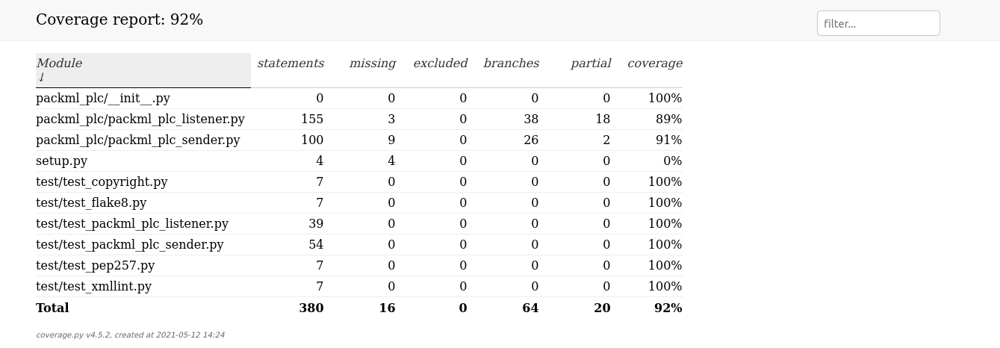
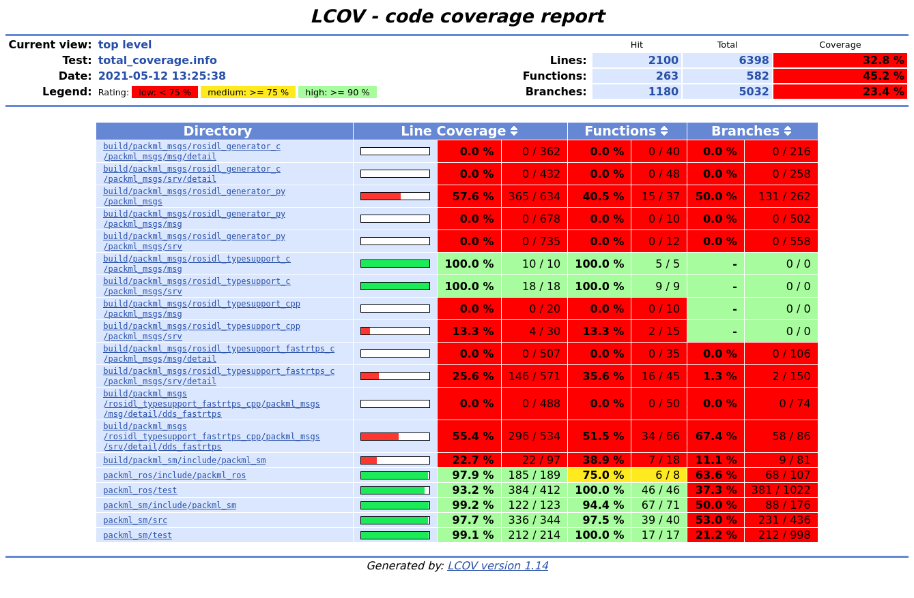

Code Coverage
=============

.. note::
   This is an **experimental** feature.

For ease-of-use and an alternative, you can check out the colcon `mixin plugins <https://github.com/colcon/colcon-mixin-repository>`__.
To setup mixin, a quick guide is avaiable at :ref:`mxsetup`.

Setup
------

Via CMake flags
^^^^^^^^^^^^^^^

Firstly, compile the repository with the following flags::

   colcon build --cmake-args -DCMAKE_C_FLAGS='--coverage' \
   -DCMAKE_CXX_FLAGS='--coverage'

After the compilation has complete, run the pytests with coverage enabled::

   colcon test --pytest-with-coverage \
   --pytest-args --cov-report=term \
   --event-handlers console_direct+

Via mixin
^^^^^^^^^

.. important::
   Ensure that colcon mixin is installed before proceeding. Checkout the quickguide on how to setup mixin here: :ref:`mxsetup`.

This is an **alternative method** that uses ``mixin`` to compile and setup the test, which would be similar to the steps mentioned aboved.

To build the package::

   colcon build --mixin coverage-gcc

After that, run ``colcon test``::

      colcon test --mixin coverage-pytest --event-handlers console_direct+

C++ Code Coverage
-----------------

To generate the code coverage report for the ``cpp`` files, the ``colcon-lcov-result`` plugin would be used. More details on the plugin could be found `here <https://github.com/colcon/colcon-lcov-result>`__.

Install the plugin via ``apt``::

   sudo apt install lcov			# Prerequiste 
   sudo apt install python3-colcon-lcov-result  # The colcon plugin

After the plugin is installed, the report could be generated via the following command::

   colcon lcov-result

A new directory would be generated and the report would be available in the ``lcov/`` directory as ``index.html``.

Python Code Coverage
--------------------

For python files, the report is generated inside the ``build/<package-name>/coverage.html/`` directory as ``index.html``.

Example
-------
We would be using the `packml_ros2 <https://github.com/1487quantum/packml_ros2>`__ in this example. Let's git clone the repository::

   git clone https://github.com/1487quantum/packml_ros2.git ~/packml_ros2	# Clone the repo
   cd ~/packml_ros2								# Enter the dir

Let's compile the files with the ``coverage`` flag::
   
   colcon build --cmake-args -DCMAKE_C_FLAGS='--coverage' -DCMAKE_CXX_FLAGS='--coverage' 

After that, run the test(s)::

   colcon test --pytest-with-coverage --pytest-args --cov-report=term --event-handlers console_direct+

The python code coverage report would be generated in the :file:`build/<package_name>/` directory. Let's take a look at the ``packml_plc`` as an example, which contains only python files::
   
   cd ~/packml_ros2/build/packml_plc/

The directory structure would look something like this:
  
.. code-block:: bash
 
   $ ls
   build                                  colcon_test.rc  packml_plc.egg-info
   colcon_build.rc                        coverage.html   pytest.xml
   colcon_command_prefix_setup_py.sh      coverage.xml
   colcon_command_prefix_setup_py.sh.env  install.log

The report summary could be found in either the :file:`coverage.html/index.html` directory, or the :file:`pytest.xml`. The ``index.html`` code coverage summary would look similar to this:

Moving on to the code coverage of the cpp files, ensure that ``lcov`` and ``colcon-lcov-result`` has been setup. We would be looking at ``packml_sm`` for this example, let's return to the root directory first::

   cd ~/packml_ros2

The code coverage summary of the test would be printed on the terminal previously. However, the cpp files require an additional step to generate the code coverage summary report. The files could be generated via the following command::

   colcon lcov-result

The ``lcov`` directory would be created and the code coverage report would be stored inside the directory as ``index.html``.

.. note::
   Do note that only the code coverage for the python files, additional steps are required to obtain the code coverage report for the C++ files. 
